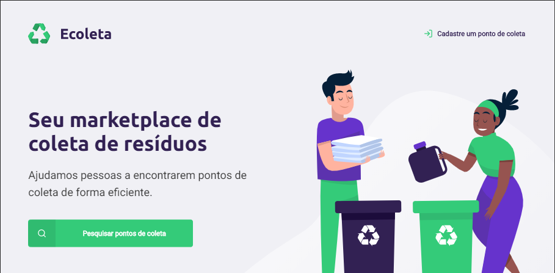

<h1 align="center">
    
</h1>

## 💻 Project

Ecoleta é um projeto para a coleta de resíduos, para a preservação do meio ambiente.

<h1 align="center">
    
</h1>

## :rocket: Technologies

Este projeto foi desenvolvido com as seguintes tecnologias:

- [Node.js][nodejs]
- [TypeScript][typescript]
- [React][reactjs]
- [React Native][rn]
- [Expo][expo]

## Layout Figma

[Figma](https://www.figma.com/file/1SxgOMojOB2zYT0Mdk28lB/)

## Page Initial Web

<h1 align="center">
    
</h1>
